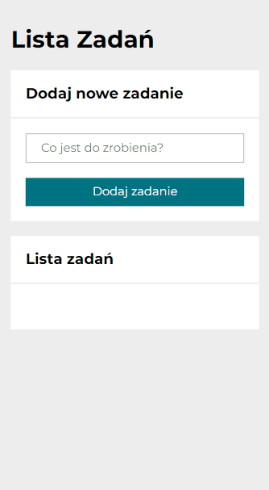

# ToDoList

## Preview

## Demo

[ToDoList]()

## Description

ToDoList allows you to add newTasks, set them as done or undone and also remove each of them. The input is always clear and on focus when you add new task.

## Technologies

- HTML
- CSS
- JS